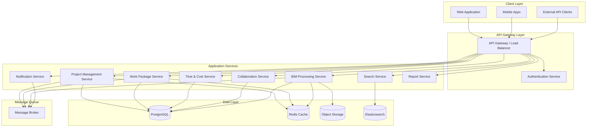

# Design Document: PROTECHT BIM

## Overview

PROTECHT BIM is a comprehensive construction project management platform that combines enterprise-grade project management capabilities with advanced Building Information Modeling (BIM) integration. The system is designed as a modern, cloud-native application with microservices architecture to support scalability, maintainability, and real-time collaboration.

### Design Philosophy

1. **Modularity**: Separate services for distinct concerns (project management, BIM processing, authentication, notifications)
2. **Real-time First**: WebSocket-based architecture for live updates and collaboration
3. **API-Driven**: All functionality exposed via REST API for integration and mobile apps
4. **Progressive Enhancement**: Core features work without BIM, BIM features enhance the experience
5. **Performance**: Optimized for large datasets (1000+ projects, 100MB+ BIM models)
6. **Extensibility**: Plugin architecture for custom integrations and workflows

### Technology Stack Recommendations

**Frontend:**
- React or Vue.js for UI framework
- TypeScript for type safety
- xeokit-sdk or IFC.js for 3D BIM visualization
- Redux or Vuex for state management
- Socket.io client for real-time updates
- Tailwind CSS for responsive design

**Backend:**
- Node.js with Express or Python with FastAPI for API services
- PostgreSQL for relational data
- Redis for caching and session management
- RabbitMQ or Apache Kafka for event streaming
- Elasticsearch for full-text search
- MinIO or S3 for object storage

**BIM Processing:**
- IfcOpenShell for IFC parsing
- Open Cascade for geometry processing
- Dedicated BIM service for model conversion and analysis

**Infrastructure:**
- Docker containers
- Kubernetes for orchestration
- Nginx for reverse proxy and load balancing
- Prometheus and Grafana for monitoring

## Architecture

### High-Level Architecture



### Microservices Architecture

**1. Project Management Service**
- Manages portfolios, programs, and projects
- Handles project hierarchies and relationships
- Provides dashboard and widget data
- Manages project templates and lifecycle phases

**2. Work Package Service**
- Core work package CRUD operations
- Gantt chart data and scheduling logic
- Work package relationships and dependencies
- Board views and agile functionality
- Baseline management

**3. Time & Cost Service**
- Time logging and timesheet management
- Cost tracking and budget management
- Report generation
- Currency conversion

**4. Collaboration Service**
- Activity feeds and notifications
- Comments and mentions
- Wiki and documentation
- Meeting management
- Forum discussions

**5. BIM Processing Service**
- IFC file parsing and conversion
- 3D model geometry processing
- BCF issue management
- Clash detection integration
- 4D/5D calculations
- Model comparison and diff

**6. Notification Service**
- Real-time WebSocket connections
- Email notifications
- Push notifications for mobile
- Notification preferences and rules

**7. Search Service**
- Full-text search across all entities
- Faceted search and filtering
- Search indexing pipeline

**8. Report Service**
- Custom report generation
- PDF/Excel export
- Scheduled reports
- Report templates

### Communication Patterns

**Synchronous (REST API):**
- Client-to-service requests
- Service-to-service calls for immediate responses
- Used for: CRUD operations, queries, authentication

**Asynchronous (Message Queue):**
- Event-driven updates between services
- Used for: notifications, search indexing, BIM processing, audit logging
- Events: WorkPackageCreated, WorkPackageUpdated, ModelUploaded, BCFIssueCreated

**Real-time (WebSocket):**
- Live updates to connected clients
- Used for: activity feeds, collaborative editing, live notifications
- Channels: project-specific, user-specific, global

### Data Flow Examples

**Creating a Work Package:**
1. Client sends POST request to API Gateway
2. Gateway authenticates and routes to Work Package Service
3. Work Package Service validates and creates record in PostgreSQL
4. Service publishes WorkPackageCreated event to message broker
5. Notification Service consumes event and sends notifications to watchers
6. Search Service consumes event and indexes work package
7. Collaboration Service consumes event and updates activity feed
8. Real-time update pushed to connected clients via WebSocket

**Uploading a BIM Model:**
1. Client uploads IFC file to API Gateway
2. Gateway streams file to Object Storage
3. BIM Service receives ModelUploaded event
4. BIM Service parses IFC file asynchronously
5. Extracted geometry and metadata stored in PostgreSQL
6. Model thumbnail generated and cached in Redis
7. ModelProcessed event published
8. Client receives notification when processing complete

## Components and Interfaces

### Core Domain Models

**Project Hierarchy:**
```typescript
interface Portfolio {
  id: string;
  name: string;
  description: string;
  owner_id: string;
  created_at: Date;
  updated_at: Date;
  custom_fields: Record<string, any>;
}

interface Program {
  id: string;
  name: string;
  description: string;
  portfolio_id: string;
  owner_id: string;
  created_at: Date;
  updated_at: Date;
  custom_fields: Record<string, any>;
}

interface Project {
  id: string;
  name: string;
  description: string;
  program_id: string | null;
  portfolio_id: string | null;
  owner_id: string;
  status: ProjectStatus;
  lifecycle_phase: LifecyclePhase;
  start_date: Date | null;
  end_date: Date | null;
  is_favorite: boolean;
  template_id: string | null;
  created_at: Date;
  updated_at: Date;
  custom_fields: Record<string, any>;
}

enum ProjectStatus {
  ACTIVE = 'active',
  ON_HOLD = 'on_hold',
  COMPLETED = 'completed',
  ARCHIVED = 'archived'
}

enum LifecyclePhase {
  INITIATION = 'initiation',
  PLANNING = 'planning',
  EXECUTION = 'execution',
  MONITORING = 'monitoring',
  CLOSURE = 'closure'
}
```

**Work Package:**
```typescript
interface WorkPackage {
  id: string;
  project_id: string;
  type: WorkPackageType;
  subject: string;
  description: string;
  status: string;
  priority: Priority;
  assignee_id: string | null;
  accountable_id: string | null;
  watcher_ids: string[];
  parent_id: string | null;
  start_date: Date | null;
  due_date: Date | null;
  estimated_hours: number | null;
  spent_hours: number;
  progress_percent: number;
  scheduling_mode: SchedulingMode;
  version_id: string | null;
  sprint_id: string | null;
  story_points: number | null;
  created_at: Date;
  updated_at: Date;
  custom_fields: Record<string, any>;
}

enum WorkPackageType {
  TASK = 'task',
  MILESTONE = 'milestone',
  PHASE = 'phase',
  FEATURE = 'feature',
  BUG = 'bug'
}

enum Priority {
  LOW = 'low',
  NORMAL = 'normal',
  HIGH = 'high',
  URGENT = 'urgent'
}

enum SchedulingMode {
  AUTOMATIC = 'automatic',
  MANUAL = 'manual'
}

interface WorkPackageRelation {
  id: string;
  from_id: string;
  to_id: string;
  relation_type: RelationType;
  lag_days: number;
  created_at: Date;
}

enum RelationType {
  SUCCESSOR = 'successor',
  PREDECESSOR = 'predecessor',
  BLOCKS = 'blocks',
  BLOCKED_BY = 'blocked_by',
  RELATES_TO = 'relates_to',
  DUPLICATES = 'duplicates',
  PARENT = 'parent',
  CHILD = 'child'
}
```

**BIM Models:**
```typescript
interface BIMModel {
  id: string;
  project_id: string;
  name: string;
  description: string;
  file_path: string;
  file_size: number;
  format: ModelFormat;
  version: number;
  parent_version_id: string | null;
  uploaded_by: string;
  processing_status: ProcessingStatus;
  thumbnail_path: string | null;
  bounding_box: BoundingBox;
  element_count: number;
  metadata: Record<string, any>;
  created_at: Date;
  updated_at: Date;
}

enum ModelFormat {
  IFC = 'ifc',
  REVIT = 'revit',
  NAVISWORKS = 'navisworks'
}

enum ProcessingStatus {
  PENDING = 'pending',
  PROCESSING = 'processing',
  COMPLETED = 'completed',
  FAILED = 'failed'
}

interface BoundingBox {
  min_x: number;
  min_y: number;
  min_z: number;
  max_x: number;
  max_y: number;
  max_z: number;
}

interface ModelElement {
  id: string;
  model_id: string;
  ifc_guid: string;
  ifc_type: string;
  name: string;
  properties: Record<string, any>;
  geometry_id: string | null;
  parent_element_id: string | null;
  floor: string | null;
  zone: string | null;
}

interface ModelViewpoint {
  id: string;
  model_id: string;
  name: string;
  camera_position: Vector3;
  camera_target: Vector3;
  camera_up: Vector3;
  visible_element_ids: string[];
  hidden_element_ids: string[];
  colored_elements: Record<string, string>;
  clipping_planes: ClippingPlane[];
  created_by: string;
  created_at: Date;
}

interface Vector3 {
  x: number;
  y: number;
  z: number;
}

interface ClippingPlane {
  position: Vector3;
  normal: Vector3;
}
```

**BCF Issues:**
```typescript
interface BCFIssue {
  id: string;
  project_id: string;
  model_id: string;
  work_package_id: string | null;
  guid: string;
  title: string;
  description: string;
  status: BCFS
tatus;
  priority: Priority;
  assignee_id: string | null;
  viewpoint: ModelViewpoint;
  affected_element_ids: string[];
  screenshot_path: string | null;
  created_by: string;
  created_at: Date;
  updated_at: Date;
  comments: BCFComment[];
}

enum BCFStatus {
  OPEN = 'open',
  IN_PROGRESS = 'in_progress',
  RESOLVED = 'resolved',
  CLOSED = 'closed'
}

interface BCFComment {
  id: string;
  issue_id: string;
  author_id: string;
  comment: string;
  viewpoint: ModelViewpoint | null;
  created_at: Date;
  modified_at: Date;
}
```

**Clash Detection:**
```typescript
interface ClashSet {
  id: string;
  project_id: string;
  name: string;
  description: string;
  model_a_id: string;
  model_b_id: string;
  clash_count: number;
  imported_from: string;
  imported_at: Date;
  created_by: string;
}

interface Clash {
  id: string;
  clash_set_id: string;
  name: string;
  status: ClashStatus;
  severity: ClashSeverity;
  element_a_id: string;
  element_b_id: string;
  clash_point: Vector3;
  distance: number;
  assigned_to: string | null;
  work_package_id: string | null;
  approved_by: string | null;
  approved_at: Date | null;
  resolution_notes: string | null;
  created_at: Date;
  updated_at: Date;
}

enum ClashStatus {
  NEW = 'new',
  ACTIVE = 'active',
  REVIEWED = 'reviewed',
  APPROVED = 'approved',
  RESOLVED = 'resolved'
}

enum ClashSeverity {
  CRITICAL = 'critical',
  MAJOR = 'major',
  MINOR = 'minor'
}
```

**Time and Cost:**
```typescript
interface TimeEntry {
  id: string;
  work_package_id: string;
  user_id: string;
  hours: number;
  date: Date;
  comment: string | null;
  billable: boolean;
  created_at: Date;
  updated_at: Date;
}

interface CostEntry {
  id: string;
  work_package_id: string;
  cost_type: CostType;
  amount: number;
  currency: string;
  units: number | null;
  unit_cost: number | null;
  description: string | null;
  date: Date;
  created_at: Date;
  updated_at: Date;
}

enum CostType {
  LABOR = 'labor',
  MATERIAL = 'material',
  EQUIPMENT = 'equipment',
  SUBCONTRACTOR = 'subcontractor',
  OTHER = 'other'
}

interface Budget {
  id: string;
  project_id: string;
  total_budget: number;
  currency: string;
  labor_budget: number;
  material_budget: number;
  equipment_budget: number;
  contingency_percent: number;
  created_at: Date;
  updated_at: Date;
}
```

**4D/5D Linking:**
```typescript
interface ModelElementLink {
  id: string;
  work_package_id: string;
  model_id: string;
  element_id: string;
  link_type: LinkType;
  created_at: Date;
}

enum LinkType {
  CONSTRUCTION = 'construction',
  DEMOLITION = 'demolition',
  TEMPORARY = 'temporary'
}

interface ElementCost {
  id: string;
  model_id: string;
  element_id: string;
  cost_type: CostType;
  unit_cost: number;
  currency: string;
  quantity: number;
  unit: string;
  total_cost: number;
  created_at: Date;
  updated_at: Date;
}
```

### API Interfaces

**Project Management API:**
```typescript
// GET /api/v1/projects
interface ListProjectsRequest {
  portfolio_id?: string;
  program_id?: string;
  status?: ProjectStatus[];
  owner_id?: string;
  favorites_only?: boolean;
  page?: number;
  per_page?: number;
  sort_by?: string;
  sort_order?: 'asc' | 'desc';
}

interface ListProjectsResponse {
  projects: Project[];
  total: number;
  page: number;
  per_page: number;
}

// POST /api/v1/projects
interface CreateProjectRequest {
  name: string;
  description?: string;
  program_id?: string;
  portfolio_id?: string;
  template_id?: string;
  start_date?: Date;
  end_date?: Date;
  custom_fields?: Record<string, any>;
}

interface CreateProjectResponse {
  project: Project;
}

// GET /api/v1/projects/:id/gantt
interface GetGanttDataRequest {
  start_date?: Date;
  end_date?: Date;
  include_relations?: boolean;
}

interface GetGanttDataResponse {
  work_packages: WorkPackage[];
  relations: WorkPackageRelation[];
  baselines?: Baseline[];
}
```

**Work Package API:**
```typescript
// POST /api/v1/work_packages
interface CreateWorkPackageRequest {
  project_id: string;
  type: WorkPackageType;
  subject: string;
  description?: string;
  assignee_id?: string;
  parent_id?: string;
  start_date?: Date;
  due_date?: Date;
  estimated_hours?: number;
  custom_fields?: Record<string, any>;
}

// PATCH /api/v1/work_packages/:id
interface UpdateWorkPackageRequest {
  subject?: string;
  description?: string;
  status?: string;
  priority?: Priority;
  assignee_id?: string;
  start_date?: Date;
  due_date?: Date;
  progress_percent?: number;
  custom_fields?: Record<string, any>;
}

// POST /api/v1/work_packages/:id/relations
interface CreateRelationRequest {
  to_id: string;
  relation_type: RelationType;
  lag_days?: number;
}
```

**BIM API:**
```typescript
// POST /api/v1/models
interface UploadModelRequest {
  project_id: string;
  name: string;
  description?: string;
  file: File;
  parent_version_id?: string;
}

interface UploadModelResponse {
  model: BIMModel;
  upload_url: string;
}

// GET /api/v1/models/:id/elements
interface ListModelElementsRequest {
  ifc_type?: string[];
  floor?: string;
  zone?: string;
  search?: string;
  page?: number;
  per_page?: number;
}

interface ListModelElementsResponse {
  elements: ModelElement[];
  total: number;
}

// POST /api/v1/models/:id/viewpoints
interface CreateViewpointRequest {
  name: string;
  camera_position: Vector3;
  camera_target: Vector3;
  camera_up: Vector3;
  visible_element_ids?: string[];
  hidden_element_ids?: string[];
  colored_elements?: Record<string, string>;
  clipping_planes?: ClippingPlane[];
}

// GET /api/v1/models/:id/geometry/:element_id
interface GetElementGeometryResponse {
  geometry: {
    vertices: number[];
    indices: number[];
    normals: number[];
    colors?: number[];
  };
}
```

**BCF API:**
```typescript
// POST /api/v1/bcf/issues
interface CreateBCFIssueRequest {
  project_id: string;
  model_id: string;
  title: string;
  description: string;
  priority: Priority;
  viewpoint: ModelViewpoint;
  affected_element_ids: string[];
  screenshot?: File;
}

// POST /api/v1/bcf/import
interface ImportBCFRequest {
  project_id: string;
  file: File; // .bcfzip file
}

// GET /api/v1/bcf/export
interface ExportBCFRequest {
  project_id: string;
  issue_ids?: string[];
}
```

**4D/5D API:**
```typescript
// POST /api/v1/models/:id/4d/link
interface Link4DRequest {
  work_package_id: string;
  element_ids: string[];
  link_type: LinkType;
}

// GET /api/v1/models/:id/4d/simulation
interface Get4DSimulationRequest {
  start_date: Date;
  end_date: Date;
  include_completed?: boolean;
}

interface Get4DSimulationResponse {
  timeline: {
    date: Date;
    visible_elements: string[];
    element_colors: Record<string, string>;
    active_work_packages: string[];
  }[];
}

// POST /api/v1/models/:id/5d/costs
interface Assign5DCostsRequest {
  element_costs: {
    element_id: string;
    cost_type: CostType;
    unit_cost: number;
    currency: string;
  }[];
}

// GET /api/v1/models/:id/5d/report
interface Get5DReportRequest {
  group_by?: 'floor' | 'zone' | 'ifc_type' | 'system';
}

interface Get5DReportResponse {
  groups: {
    name: string;
    element_count: number;
    total_cost: number;
    breakdown: Record<CostType, number>;
  }[];
  total_cost: number;
}
```

### Service Interfaces

**Scheduling Engine:**
```typescript
interface SchedulingEngine {
  /**
   * Recalculate dates for work packages in automatic scheduling mode
   */
  recalculateSchedule(projectId: string, changedWorkPackageIds: string[]): Promise<ScheduleUpdate[]>;
  
  /**
   * Detect circular dependencies in work package relations
   */
  detectCircularDependencies(projectId: string): Promise<CircularDependency[]>;
  
  /**
   * Calculate critical path for project
   */
  calculateCriticalPath(projectId: string): Promise<WorkPackage[]>;
  
  /**
   * Validate work package dates against constraints
   */
  validateDates(workPackage: WorkPackage, relations: WorkPackageRelation[]): ValidationResult;
}

interface ScheduleUpdate {
  work_package_id: string;
  old_start_date: Date;
  new_start_date: Date;
  old_due_date: Date;
  new_due_date: Date;
  reason: string;
}

interface CircularDependency {
  work_package_ids: string[];
  relation_chain: WorkPackageRelation[];
}
```

**BIM Processing Engine:**
```typescript
interface BIMProcessor {
  /**
   * Parse IFC file and extract geometry and metadata
   */
  parseIFC(filePath: string): Promise<ParsedModel>;
  
  /**
   * Generate thumbnail image for model
   */
  generateThumbnail(modelId: string, width: number, height: number): Promise<string>;
  
  /**
   * Extract quantities from model elements
   */
  extractQuantities(modelId: string): Promise<ElementQuantity[]>;
  
  /**
   * Compare two model versions and identify differences
   */
  compareModels(modelAId: string, modelBId: string, tolerance: number): Promise<ModelDifference[]>;
  
  /**
   * Convert proprietary format to IFC
   */
  convertToIFC(filePath: string, sourceFormat: ModelFormat): Promise<string>;
}

interface ParsedModel {
  elements: ModelElement[];
  bounding_box: BoundingBox;
  metadata: Record<string, any>;
  geometry_files: string[];
}

interface ElementQuantity {
  element_id: string;
  length?: number;
  area?: number;
  volume?: number;
  count: number;
  unit: string;
}

interface ModelDifference {
  type: 'added' | 'removed' | 'modified' | 'unchanged';
  element_id: string;
  changes?: Record<string, { old: any; new: any }>;
}
```

**Notification Engine:**
```typescript
interface NotificationEngine {
  /**
   * Send notification to users
   */
  notify(notification: Notification): Promise<void>;
  
  /**
   * Subscribe user to WebSocket channel
   */
  subscribe(userId: string, channel: string): Promise<void>;
  
  /**
   * Broadcast message to channel
   */
  broadcast(channel: string, message: any): Promise<void>;
  
  /**
   * Get user notification preferences
   */
  getPreferences(userId: string): Promise<NotificationPreferences>;
}

interface Notification {
  user_ids: string[];
  type: NotificationType;
  title: string;
  message: string;
  link?: string;
  data?: Record<string, any>;
  channels: NotificationChannel[];
}

enum NotificationType {
  WORK_PACKAGE_ASSIGNED = 'work_package_assigned',
  WORK_PACKAGE_UPDATED = 'work_package_updated',
  WORK_PACKAGE_COMMENTED = 'work_package_commented',
  MENTION = 'mention',
  BCF_ISSUE_CREATED = 'bcf_issue_created',
  MODEL_PROCESSED = 'model_processed',
  CLASH_ASSIGNED = 'clash_assigned'
}

enum NotificationChannel {
  IN_APP = 'in_app',
  EMAIL = 'email',
  PUSH = 'push',
  WEBSOCKET = 'websocket'
}

interface NotificationPreferences {
  user_id: string;
  email_enabled: boolean;
  push_enabled: boolean;
  notification_rules: {
    type: NotificationType;
    channels: NotificationChannel[];
    enabled: boolean;
  }[];
}
```

## Data Models

### Database Schema

**PostgreSQL Tables:**

```sql
-- Projects and Hierarchy
CREATE TABLE portfolios (
  id UUID PRIMARY KEY DEFAULT gen_random_uuid(),
  name VARCHAR(255) NOT NULL,
  description TEXT,
  owner_id UUID NOT NULL REFERENCES users(id),
  created_at TIMESTAMP NOT NULL DEFAULT NOW(),
  updated_at TIMESTAMP NOT NULL DEFAULT NOW(),
  custom_fields JSONB
);

CREATE TABLE programs (
  id UUID PRIMARY KEY DEFAULT gen_random_uuid(),
  name VARCHAR(255) NOT NULL,
  description TEXT,
  portfolio_id UUID REFERENCES portfolios(id) ON DELETE CASCADE,
  owner_id UUID NOT NULL REFERENCES users(id),
  created_at TIMESTAMP NOT NULL DEFAULT NOW(),
  updated_at TIMESTAMP NOT NULL DEFAULT NOW(),
  custom_fields JSONB
);

CREATE TABLE projects (
  id UUID PRIMARY KEY DEFAULT gen_random_uuid(),
  name VARCHAR(255) NOT NULL,
  description TEXT,
  program_id UUID REFERENCES programs(id) ON DELETE SET NULL,
  portfolio_id UUID REFERENCES portfolios(id) ON DELETE SET NULL,
  owner_id UUID NOT NULL REFERENCES users(id),
  status VARCHAR(50) NOT NULL DEFAULT 'active',
  lifecycle_phase VARCHAR(50) NOT NULL DEFAULT 'initiation',
  start_date DATE,
  end_date DATE,
  template_id UUID REFERENCES project_templates(id),
  created_at TIMESTAMP NOT NULL DEFAULT NOW(),
  updated_at TIMESTAMP NOT NULL DEFAULT NOW(),
  custom_fields JSONB,
  CONSTRAINT valid_status CHECK (status IN ('active', 'on_hold', 'completed', 'archived')),
  CONSTRAINT valid_phase CHECK (lifecycle_phase IN ('initiation', 'planning', 'execution', 'monitoring', 'closure'))
);

CREATE INDEX idx_projects_program ON projects(program_id);
CREATE INDEX idx_projects_portfolio ON projects(portfolio_id);
CREATE INDEX idx_projects_owner ON projects(owner_id);
CREATE INDEX idx_projects_status ON projects(status);

-- Work Packages
CREATE TABLE work_packages (
  id UUID PRIMARY KEY DEFAULT gen_random_uuid(),
  project_id UUID NOT NULL REFERENCES projects(id) ON DELETE CASCADE,
  type VARCHAR(50) NOT NULL,
  subject VARCHAR(500) NOT NULL,
  description TEXT,
  status VARCHAR(50) NOT NULL,
  priority VARCHAR(50) NOT NULL DEFAULT 'normal',
  assignee_id UUID REFERENCES users(id),
  accountable_id UUID REFERENCES users(id),
  parent_id UUID REFERENCES work_packages(id) ON DELETE CASCADE,
  start_date DATE,
  due_date DATE,
  estimated_hours DECIMAL(10,2),
  spent_hours DECIMAL(10,2) DEFAULT 0,
  progress_percent INTEGER DEFAULT 0 CHECK (progress_percent >= 0 AND progress_percent <= 100),
  scheduling_mode VARCHAR(20) NOT NULL DEFAULT 'automatic',
  version_id UUID REFERENCES versions(id),
  sprint_id UUID REFERENCES sprints(id),
  story_points INTEGER,
  created_at TIMESTAMP NOT NULL DEFAULT NOW(),
  updated_at TIMESTAMP NOT NULL DEFAULT NOW(),
  custom_fields JSONB,
  CONSTRAINT valid_type CHECK (type IN ('task', 'milestone', 'phase', 'feature', 'bug')),
  CONSTRAINT valid_priority CHECK (priority IN ('low', 'normal', 'high', 'urgent')),
  CONSTRAINT valid_scheduling CHECK (scheduling_mode IN ('automatic', 'manual'))
);

CREATE INDEX idx_wp_project ON work_packages(project_id);
CREATE INDEX idx_wp_assignee ON work_packages(assignee_id);
CREATE INDEX idx_wp_parent ON work_packages(parent_id);
CREATE INDEX idx_wp_status ON work_packages(status);
CREATE INDEX idx_wp_dates ON work_packages(start_date, due_date);

CREATE TABLE work_package_relations (
  id UUID PRIMARY KEY DEFAULT gen_random_uuid(),
  from_id UUID NOT NULL REFERENCES work_packages(id) ON DELETE CASCADE,
  to_id UUID NOT NULL REFERENCES work_packages(id) ON DELETE CASCADE,
  relation_type VARCHAR(50) NOT NULL,
  lag_days INTEGER DEFAULT 0,
  created_at TIMESTAMP NOT NULL DEFAULT NOW(),
  CONSTRAINT valid_relation CHECK (relation_type IN ('successor', 'predecessor', 'blocks', 'blocked_by', 'relates_to', 'duplicates')),
  CONSTRAINT no_self_relation CHECK (from_id != to_id)
);

CREATE INDEX idx_wpr_from ON work_package_relations(from_id);
CREATE INDEX idx_wpr_to ON work_package_relations(to_id);

CREATE TABLE work_package_watchers (
  work_package_id UUID NOT NULL REFERENCES work_packages(id) ON DELETE CASCADE,
  user_id UUID NOT NULL REFERENCES users(id) ON DELETE CASCADE,
  created_at TIMESTAMP NOT NULL DEFAULT NOW(),
  PRIMARY KEY (work_package_id, user_id)
);

-- BIM Models
CREATE TABLE bim_models (
  id UUID PRIMARY KEY DEFAULT gen_random_uuid(),
  project_id UUID NOT NULL REFERENCES projects(id) ON DELETE CASCADE,
  name VARCHAR(255) NOT NULL,
  description TEXT,
  file_path VARCHAR(500) NOT NULL,
  file_size BIGINT NOT NULL,
  format VARCHAR(50) NOT NULL,
  version INTEGER NOT NULL DEFAULT 1,
  parent_version_id UUID REFERENCES bim_models(id),
  uploaded_by UUID NOT NULL REFERENCES users(id),
  processing_status VARCHAR(50) NOT NULL DEFAULT 'pending',
  thumbnail_path VARCHAR(500),
  bounding_box JSONB,
  element_count INTEGER DEFAULT 0,
  metadata JSONB,
  created_at TIMESTAMP NOT NULL DEFAULT NOW(),
  updated_at TIMESTAMP NOT NULL DEFAULT NOW(),
  CONSTRAINT valid_format CHECK (format IN ('ifc', 'revit', 'navisworks')),
  CONSTRAINT valid_processing CHECK (processing_status IN ('pending', 'processing', 'completed', 'failed'))
);

CREATE INDEX idx_models_project ON bim_models(project_id);
CREATE INDEX idx_models_status ON bim_models(processing_status);

CREATE TABLE model_elements (
  id UUID PRIMARY KEY DEFAULT gen_random_uuid(),
  model_id UUID NOT NULL REFERENCES bim_models(id) ON DELETE CASCADE,
  ifc_guid VARCHAR(22) NOT NULL,
  ifc_type VARCHAR(100) NOT NULL,
  name VARCHAR(255),
  properties JSONB,
  geometry_id VARCHAR(100),
  parent_element_id UUID REFERENCES model_elements(id),
  floor VARCHAR(100),
  zone VARCHAR(100),
  UNIQUE(model_id, ifc_guid)
);

CREATE INDEX idx_elements_model ON model_elements(model_id);
CREATE INDEX idx_elements_type ON model_elements(ifc_type);
CREATE INDEX idx_elements_floor ON model_elements(floor);
CREATE INDEX idx_elements_guid ON model_elements(ifc_guid);

-- BCF Issues
CREATE TABLE bcf_issues (
  id UUID PRIMARY KEY DEFAULT gen_random_uuid(),
  project_id UUID NOT NULL REFERENCES projects(id) ON DELETE CASCADE,
  model_id UUID NOT NULL REFERENCES bim_models(id) ON DELETE CASCADE,
  work_package_id UUID REFERENCES work_packages(id) ON DELETE SET NULL,
  guid UUID NOT NULL UNIQUE,
  title VARCHAR(500) NOT NULL,
  description TEXT,
  status VARCHAR(50) NOT NULL DEFAULT 'open',
  priority VARCHAR(50) NOT NULL DEFAULT 'normal',
  assignee_id UUID REFERENCES users(id),
  viewpoint JSONB NOT NULL,
  screenshot_path VARCHAR(500),
  created_by UUID NOT NULL REFERENCES users(id),
  created_at TIMESTAMP NOT NULL DEFAULT NOW(),
  updated_at TIMESTAMP NOT NULL DEFAULT NOW(),
  CONSTRAINT valid_bcf_status CHECK (status IN ('open', 'in_progress', 'resolved', 'closed'))
);

CREATE INDEX idx_bcf_project ON bcf_issues(project_id);
CREATE INDEX idx_bcf_model ON bcf_issues(model_id);
CREATE INDEX idx_bcf_wp ON bcf_issues(work_package_id);

CREATE TABLE bcf_issue_elements (
  issue_id UUID NOT NULL REFERENCES bcf_issues(id) ON DELETE CASCADE,
  element_id UUID NOT NULL REFERENCES model_elements(id) ON DELETE CASCADE,
  PRIMARY KEY (issue_id, element_id)
);

-- Clash Detection
CREATE TABLE clash_sets (
  id UUID PRIMARY KEY DEFAULT gen_random_uuid(),
  project_id UUID NOT NULL REFERENCES projects(id) ON DELETE CASCADE,
  name VARCHAR(255) NOT NULL,
  description TEXT,
  model_a_id UUID NOT NULL REFERENCES bim_models(id) ON DELETE CASCADE,
  model_b_id UUID NOT NULL REFERENCES bim_models(id) ON DELETE CASCADE,
  clash_count INTEGER DEFAULT 0,
  imported_from VARCHAR(255),
  imported_at TIMESTAMP NOT NULL DEFAULT NOW(),
  created_by UUID NOT NULL REFERENCES users(id)
);

CREATE TABLE clashes (
  id UUID PRIMARY KEY DEFAULT gen_random_uuid(),
  clash_set_id UUID NOT NULL REFERENCES clash_sets(id) ON DELETE CASCADE,
  name VARCHAR(255) NOT NULL,
  status VARCHAR(50) NOT NULL DEFAULT 'new',
  severity VARCHAR(50) NOT NULL,
  element_a_id UUID NOT NULL REFERENCES model_elements(id),
  element_b_id UUID NOT NULL REFERENCES model_elements(id),
  clash_point JSONB NOT NULL,
  distance DECIMAL(10,4),
  assigned_to UUID REFERENCES users(id),
  work_package_id UUID REFERENCES work_packages(id),
  approved_by UUID REFERENCES users(id),
  approved_at TIMESTAMP,
  resolution_notes TEXT,
  created_at TIMESTAMP NOT NULL DEFAULT NOW(),
  updated_at TIMESTAMP NOT NULL DEFAULT NOW(),
  CONSTRAINT valid_clash_status CHECK (status IN ('new', 'active', 'reviewed', 'approved', 'resolved')),
  CONSTRAINT valid_severity CHECK (severity IN ('critical', 'major', 'minor'))
);

CREATE INDEX idx_clashes_set ON clashes(clash_set_id);
CREATE INDEX idx_clashes_status ON clashes(status);
CREATE INDEX idx_clashes_assigned ON clashes(assigned_to);

-- 4D/5D Linking
CREATE TABLE model_element_links (
  id UUID PRIMARY KEY DEFAULT gen_random_uuid(),
  work_package_id UUID NOT NULL REFERENCES work_packages(id) ON DELETE CASCADE,
  model_id UUID NOT NULL REFERENCES bim_models(id) ON DELETE CASCADE,
  element_id UUID NOT NULL REFERENCES model_elements(id) ON DELETE CASCADE,
  link_type VARCHAR(50) NOT NULL DEFAULT 'construction',
  created_at TIMESTAMP NOT NULL DEFAULT NOW(),
  CONSTRAINT valid_link_type CHECK (link_type IN ('construction', 'demolition', 'temporary')),
  UNIQUE(work_package_id, element_id)
);

CREATE INDEX idx_links_wp ON model_element_links(work_package_id);
CREATE INDEX idx_links_element ON model_element_links(element_id);

CREATE TABLE element_costs (
  id UUID PRIMARY KEY DEFAULT gen_random_uuid(),
  model_id UUID NOT NULL REFERENCES bim_models(id) ON DELETE CASCADE,
  element_id UUID NOT NULL REFERENCES model_elements(id) ON DELETE CASCADE,
  cost_type VARCHAR(50) NOT NULL,
  unit_cost DECIMAL(15,2) NOT NULL,
  currency VARCHAR(3) NOT NULL DEFAULT 'USD',
  quantity DECIMAL(15,4) NOT NULL,
  unit VARCHAR(50) NOT NULL,
  total_cost DECIMAL(15,2) GENERATED ALWAYS AS (unit_cost * quantity) STORED,
  created_at TIMESTAMP NOT NULL DEFAULT NOW(),
  updated_at TIMESTAMP NOT NULL DEFAULT NOW(),
  CONSTRAINT valid_cost_type CHECK (cost_type IN ('labor', 'material', 'equipment', 'subcontractor', 'other'))
);

CREATE INDEX idx_costs_element ON element_costs(element_id);

-- Time and Cost Tracking
CREATE TABLE time_entries (
  id UUID PRIMARY KEY DEFAULT gen_random_uuid(),
  work_package_id UUID NOT NULL REFERENCES work_packages(id) ON DELETE CASCADE,
  user_id UUID NOT NULL REFERENCES users(id) ON DELETE CASCADE,
  hours DECIMAL(10,2) NOT NULL CHECK (hours > 0),
  date DATE NOT NULL,
  comment TEXT,
  billable BOOLEAN DEFAULT true,
  created_at TIMESTAMP NOT NULL DEFAULT NOW(),
  updated_at TIMESTAMP NOT NULL DEFAULT NOW()
);

CREATE INDEX idx_time_wp ON time_entries(work_package_id);
CREATE INDEX idx_time_user ON time_entries(user_id);
CREATE INDEX idx_time_date ON time_entries(date);

CREATE TABLE cost_entries (
  id UUID PRIMARY KEY DEFAULT gen_random_uuid(),
  work_package_id UUID NOT NULL REFERENCES work_packages(id) ON DELETE CASCADE,
  cost_type VARCHAR(50) NOT NULL,
  amount DECIMAL(15,2) NOT NULL,
  currency VARCHAR(3) NOT NULL DEFAULT 'USD',
  units DECIMAL(10,2),
  unit_cost DECIMAL(15,2),
  description TEXT,
  date DATE NOT NULL,
  created_at TIMESTAMP NOT NULL DEFAULT NOW(),
  updated_at TIMESTAMP NOT NULL DEFAULT NOW(),
  CONSTRAINT valid_cost_type CHECK (cost_type IN ('labor', 'material', 'equipment', 'subcontractor', 'other'))
);

CREATE INDEX idx_cost_wp ON cost_entries(work_package_id);
CREATE INDEX idx_cost_date ON cost_entries(date);

CREATE TABLE budgets (
  id UUID PRIMARY KEY DEFAULT gen_random_uuid(),
  project_id UUID NOT NULL REFERENCES projects(id) ON DELETE CASCADE,
  total_budget DECIMAL(15,2) NOT NULL,
  currency VARCHAR(3) NOT NULL DEFAULT 'USD',
  labor_budget DECIMAL(15,2),
  material_budget DECIMAL(15,2),
  equipment_budget DECIMAL(15,2),
  contingency_percent DECIMAL(5,2) DEFAULT 10.00,
  created_at TIMESTAMP NOT NULL DEFAULT NOW(),
  updated_at TIMESTAMP NOT NULL DEFAULT NOW(),
  UNIQUE(project_id)
);
```

### Caching Strategy

**Redis Cache Keys:**

```
project:{project_id} - Project details (TTL: 1 hour)
project:{project_id}:work_packages - Work package list (TTL: 5 minutes)
project:{project_id}:gantt - Gantt chart data (TTL: 5 minutes)
model:{model_id}:thumbnail - Model thumbnail (TTL: 24 hours)
model:{model_id}:elements - Element list (TTL: 1 hour)
model:{model_id}:geometry:{element_id} - Element geometry (TTL: 24 hours)
user:{user_id}:permissions - User permissions (TTL: 15 minutes)
user:{user_id}:notifications - Recent notifications (TTL: 5 minutes)
```

**Cache Invalidation:**
- Work package changes: Invalidate project work package list and Gantt cache
- Model upload: Invalidate model caches
- Permission changes: Invalidate user permission cache
- Use pub/sub for distributed cache invalidation across service instances

### File Storage Structure

```
/storage/
  /projects/
    /{project_id}/
      /models/
        /{model_id}/
          /original/
            model.ifc
          /geometry/
            {element_id}.bin
          /thumbnails/
            preview.png
      /attachments/
        /{work_package_id}/
          {file_id}.{ext}
      /bcf/
        /{issue_id}/
          screenshot.png
      /exports/
        report_{timestamp}.pdf
```

